# RealEstateAggregator – Architektura systému

> **Verze:** Session 19 (27. února 2026)
> **Účel:** Zevrubný technický popis celého systému – stack, datový tok, RAG pipeline do nejmenšího
> detailu, AI funkce, Vision OCR, DB schéma, prostorové filtry, API reference.

---

## Obsah

1. [Executive Summary](#1-executive-summary)
2. [Technology Stack](#2-technology-stack)
3. [Systémová architektura (Docker Compose)](#3-systémová-architektura-docker-compose)
4. [Scraping pipeline](#4-scraping-pipeline)
   - 4.1 [Tok dat end-to-end](#41-tok-dat-end-to-end)
   - 4.2 [Upsert & deduplication](#42-upsert--deduplication)
   - 4.3 [FilterManager pipeline](#43-filtermanager-pipeline)
   - 4.4 [APScheduler (naplánovaný běh)](#44-apscheduler-naplánovaný-běh)
5. [RAG – Retrieval-Augmented Generation](#5-rag--retrieval-augmented-generation)
   - 5.1 [Přehled tří pipeline](#51-přehled-tří-pipeline)
   - 5.2 [Ingestion pipeline – detail](#52-ingestion-pipeline--detail)
   - 5.3 [Retrieval pipeline – detail](#53-retrieval-pipeline--detail)
   - 5.4 [Generation pipeline – detail](#54-generation-pipeline--detail)
   - 5.5 [Plný sekvenční diagram RAG cyklu](#55-plný-sekvenční-diagram-rag-cyklu)
   - 5.6 [Vektorové indexy a SQL](#56-vektorové-indexy-a-sql)
   - 5.7 [Cosine similarity – matematika](#57-cosine-similarity--matematika)
   - 5.8 [Fallback strategie](#58-fallback-strategie)
6. [Ollama Vision – klasifikace fotek](#6-ollama-vision--klasifikace-fotek)
   - 6.1 [Dvouprůchodová klasifikace](#61-dvouprůchodová-klasifikace)
   - 6.2 [Klasifikace fotek z prohlídky](#62-klasifikace-fotek-z-prohlídky)
   - 6.3 [Alt text (WCAG 2.2 AA)](#63-alt-text-wcag-22-aa)
7. [Ollama Text – AI funkce](#7-ollama-text--ai-funkce)
   - 7.1 [Smart Tags](#71-smart-tags)
   - 7.2 [Normalizace dat](#72-normalizace-dat)
   - 7.3 [Cenový signál](#73-cenový-signál)
   - 7.4 [Detekce duplikátů](#74-detekce-duplikátů)
   - 7.5 [Robustní JSON parsování](#75-robustní-json-parsování)
8. [KN OCR – Screenshot z katastru](#8-kn-ocr--screenshot-z-katastru)
9. [Prostorové vyhledávání (PostGIS)](#9-prostorové-vyhledávání-postgis)
   - 9.1 [Koridorové filtrování](#91-koridorové-filtrování)
   - 9.2 [Geocoding pipeline](#92-geocoding-pipeline)
10. [DB schéma (ERD)](#10-db-schéma-erd)
11. [API endpoint reference](#11-api-endpoint-reference)
12. [MCP Tools – Claude Desktop integrace](#12-mcp-tools--claude-desktop-integrace)
13. [Export pipeline (Google Drive / OneDrive)](#13-export-pipeline-google-drive--onedrive)
14. [Konfigurace a secrets](#14-konfigurace-a-secrets)
15. [Monitoring a logging](#15-monitoring-a-logging)
16. [Výkonnostní tipy & indexová strategie](#16-výkonnostní-tipy--indexová-strategie)

---

## 1. Executive Summary

**RealEstateAggregator** je plnohodnotná česká realitní agregační platforma druhé generace. Kontinuálně stahuje inzeráty z **13 zdrojů**, ukládá je do PostgreSQL s PostGIS a pgvector a nabízí nad nimi celou sadu AI služeb:

```
┌─────────────────────────────────────────────────────────────────────────┐
│                     WHAT THIS SYSTEM CAN DO                             │
├────────────────────────────────┬────────────────────────────────────────┤
│ Agregace inzerátů (13 zdrojů)  │ Python AsyncIO + httpx/BS4, upsert    │
│ Plnotextové vyhledávání        │ PostgreSQL tsvector + GIN index        │
│ Sémantické vyhledávání         │ pgvector HNSW (768-dim), nomic-embed  │
│ RAG chat nad inzeráty          │ pgvector IVFFlat + qwen2.5:14b        │
│ Klasifikace fotek (Vision)     │ llama3.2-vision:11b (2 průchody)      │
│ Smart tagy + normalizace + cena│ llama3.2 text, strukturované prompty  │
│ KN OCR ze screenshotu          │ llama3.2-vision, Ctrl+V clipboard     │
│ Prostorové filtrování          │ PostGIS ST_Buffer + OSRM routing       │
│ Katastr nemovitostí            │ RÚIAN / ČÚZK REST + OCR Vision        │
│ MCP integrace (Claude Desktop) │ Python FastAPI MCP SSE server          │
│ Export pro AI analýzu          │ Google Drive / OneDrive + šablony .md │
│ Geocoding 97 % pokrytí         │ Nominatim OSM (1 366 / 1 416 GPS bodů)│
└────────────────────────────────┴────────────────────────────────────────┘
```

**Aktuální stav DB:** 1 416 inzerátů, 13 zdrojů, 97 % geocódováno.

---

## 2. Technology Stack

### 2.1 Backend

| Technologie | Verze | Role |
|---|---|---|
| .NET / ASP.NET Core | **10.0** | ASP.NET Minimal API, Blazor Server |
| Entity Framework Core | 10.x | ORM, migrations, LINQ queries |
| Npgsql.EntityFrameworkCore.PostgreSQL | 10.x | PostgreSQL provider + NTS geometry |
| Pgvector.EntityFrameworkCore | latest | `Vector(dim)` typ pro pgvector |
| NetTopologySuite | 2.x | `Geometry`, `Point`, `Polygon` v C# |
| Serilog.AspNetCore | 9.x | Strukturované logování (console/JSON) |

### 2.2 Frontend

| Technologie | Verze | Role |
|---|---|---|
| Blazor Server | .NET 10 | Interaktivní UI přes SignalR WebSocket |
| MudBlazor | **9.x** | UI komponenty (karty, filtry, dialogy, carousel) |
| Leaflet.js | 1.x | Interaktivní mapa (markery + koridory) |
| Vanilla JS interop | – | `kn-ocr.js` (clipboard paste, drag&drop, FileReader) |

### 2.3 Databáze a rozšíření

| Technologie | Verze | Role |
|---|---|---|
| PostgreSQL | **15** | Primární databáze, schema `re_realestate` |
| PostGIS | **3.4** | `geometry`, `GIST` index, `ST_Buffer`, `ST_Intersects` |
| pgvector | **0.7+** | `vector(768)`, `HNSW` a `IVFFlat` indexy |
| `uuid-ossp` | built-in | `gen_random_uuid()` |

### 2.4 AI / LLM modely (Ollama lokálně)

```
┌──────────────────────────┬─────────────┬────────┬───────────────────────────────────┐
│ Model                    │ Typ         │ Dim    │ Účel                              │
├──────────────────────────┼─────────────┼────────┼───────────────────────────────────┤
│ nomic-embed-text         │ Embedding   │ 768    │ RAG analýzy – listing_analyses    │
│ qwen2.5:14b              │ Chat LLM    │ –      │ RAG – generování odpovědí         │
│ llama3.2-vision:11b      │ Vision LLM  │ –      │ Klasifikace fotek, KN OCR         │
│ llama3.2 (text)          │ Chat LLM    │ –      │ Smart tags, normalizace, cena      │
│ text-embedding-3-small*  │ Embedding   │ 1 536  │ *Legacy: description_embedding    │
└──────────────────────────┴─────────────┴────────┴───────────────────────────────────┘
* OpenAI – používán historicky pro listings.description_embedding (HNSW index).
  Nový RAG stack běží 100 % lokálně na Ollama (nomic-embed-text, 768 dim).
```

### 2.5 Infrastructure & External

| Technologie | Účel |
|---|---|
| Docker Compose | Orchestrace 5 služeb + pgAdmin (profile: tools) |
| Colima (ARM64) | macOS Docker runtime, native ARM64, bez Rosetta |
| OSRM | Open-source routing (koridorový buffer) |
| Nominatim (OSM) | Geocoding s rate-limitem 1,1 s/req |
| RÚIAN / ČÚZK | Katastrální REST API + OCR Vision fallback |
| APScheduler (Python) | Cron: denně 03:00 + týdně neděle 02:00 |
| Google Drive / OneDrive | Cloud storage pro AI export balíčky |

---

## 3. Systémová architektura (Docker Compose)

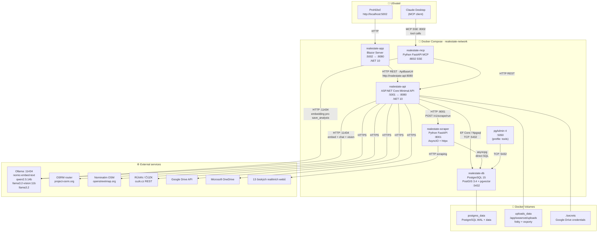

### Vnitřní síťová komunikace

| Caller | Callee | Adresa (Docker-intern) |
|---|---|---|
| `app` | `api` | `http://realestate-api:8080` |
| `api` | `scraper` | `http://realestate-scraper:8001` |
| `api` / `mcp` | Ollama | `http://host.docker.internal:11434` |
| `api` / `scraper` | postgres | `realestate-db:5432` |

---

## 4. Scraping pipeline

### 4.1 Tok dat end-to-end

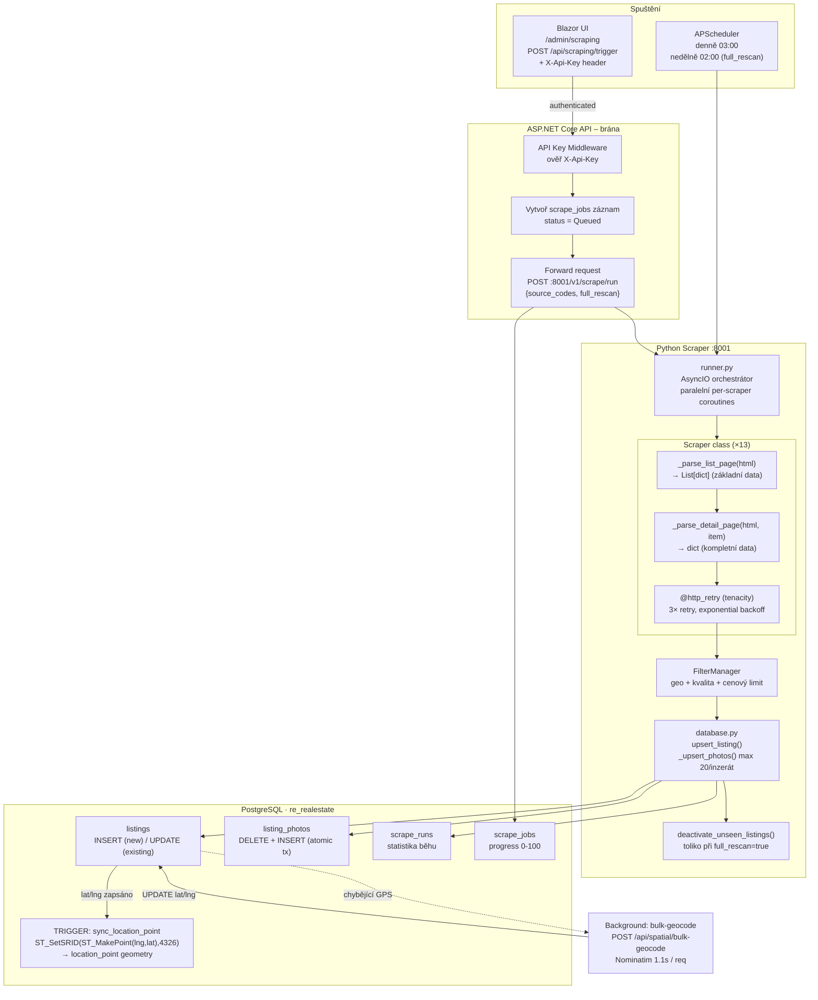

### 4.2 Upsert & deduplication

Klíčem zůstává kompozitní dvojice `(source_id, external_id)`. Scraper nikdy nevkládá duplicity – místo toho přepisuje data existujícího záznamu a aktualizuje `last_seen_at`.

```python
# database.py – zjednodušený pseudokód
existing = await conn.fetchrow(
    '''SELECT id FROM re_realestate.listings
       WHERE source_id = $1 AND external_id = $2''',
    source_id, external_id
)

if existing:
    # UPDATE – zachováme first_seen_at, přepíšeme ostatní
    await conn.execute(
        "UPDATE re_realestate.listings SET title=$1, price=$2, ..., last_seen_at=now() WHERE id=$3",
        title, price, existing["id"]
    )
else:
    # INSERT – nový inzerát
    listing_id = uuid4()
    await conn.execute(
        "INSERT INTO re_realestate.listings (id, source_id, external_id, ..., first_seen_at, last_seen_at)"
        " VALUES ($1,$2,$3,...,now(),now())",
        listing_id, source_id, external_id
    )

# Fotky: transakce DELETE + INSERT (atomická přestavba)
async with conn.transaction():
    await conn.execute(
        "DELETE FROM re_realestate.listing_photos WHERE listing_id=$1", listing_id
    )
    for idx, url in enumerate(photo_urls[:20]):
        await conn.execute("INSERT INTO re_realestate.listing_photos ...")
```

### 4.3 FilterManager pipeline

Každý raw inzerát projde třemi síty. Pořadí je důležité – geo-sito je nejrychlejší a zfiltruje nejvíce.

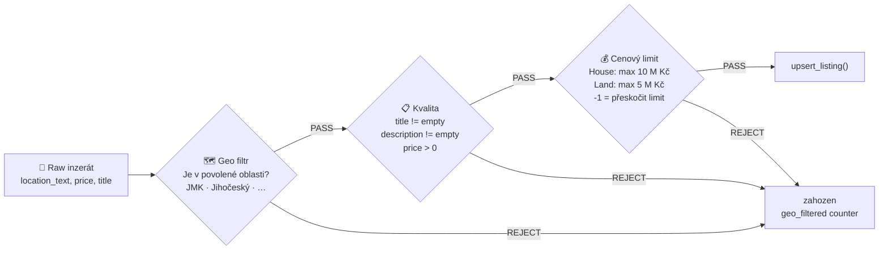

### 4.4 APScheduler (naplánovaný běh)

```python
# scraper/api/main.py
scheduler = AsyncIOScheduler(timezone="Europe/Prague")

# Denní incremental: rychlý průchod nových inzerátů
scheduler.add_job(daily_scrape,  "cron", hour=3, minute=0,
                  id="daily_scrape",  args=[False])   # full_rescan=False

# Týdenní full rescan: deaktivace zaniklých inzerátů
scheduler.add_job(weekly_rescan, "cron", day_of_week="sun", hour=2,
                  id="weekly_rescan", args=[True])    # full_rescan=True
```

Ruční ovládání přes endpoint `/v1/schedule/trigger-now?jobId=daily_scrape`.

---

## 5. RAG – Retrieval-Augmented Generation

RAG systém umožňuje **přirozenojazyčný chat nad uloženými analýzami** konkrétního inzerátu (nebo cross-listing vyhledávání). Skládá se z přesně tří pipeline, které na sebe navazují.

### 5.1 Přehled tří pipeline

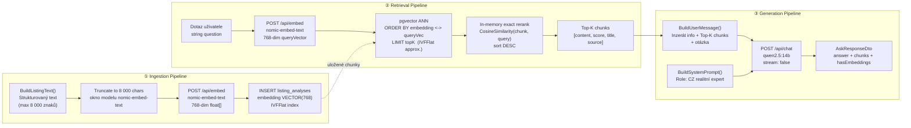

### 5.2 Ingestion pipeline – detail

#### Kde vznikají analýzy (tři zdroje)

| Source tag | Způsob vzniku | Obsah |
|---|---|---|
| `"auto"` | `POST /api/rag/embed/{id}` nebo bulk-embed | Strukturovaný text z `BuildListingText()` |
| `"claude"` | MCP `save_analysis` tool (Claude Desktop) | Libovolný text – výsledek AI analýzy |
| `"user"` | UI tlačítko „Uložit poznámku" | Uživatelovy manuální poznámky |

#### `BuildListingText()` – šablona

```
# {Title}
Typ: {PropertyType} | Nabídka: {OfferType}
Cena: {Price} Kč
Lokalita: {LocationText}
Obec: {Municipality} | Okres: {District}
Dispozice: {Disposition} | Plocha zastavěná: {AreaBuiltUp} m² | Plocha pozemku: {AreaLand} m²
Stav: {Condition} | Konstrukce: {ConstructionType}

## Popis
{Description}
```

- Truncace na **8 000 znaků** před embeddingem (okno `nomic-embed-text`)
- Idempotence: `BulkEmbedDescriptionsAsync` přeskakuje inzeráty, které již mají `source="auto"` analýzu

#### Tok embedding requestu

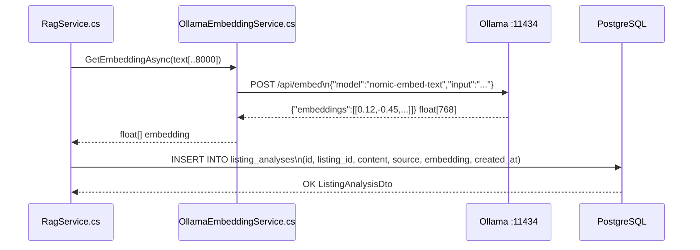

### 5.3 Retrieval pipeline – detail

#### `FindSimilarAsync()` – dvě varianty

```sql
-- Listing-specifické vyhledávání (pro AskListingAsync)
SELECT id, listing_id, content, title, source, embedding, created_at
FROM   re_realestate.listing_analyses
WHERE  listing_id = :listingId
  AND  embedding IS NOT NULL
ORDER  BY embedding <-> :queryVector   -- L2 distance (pgvector operátor)
LIMIT  :topK;

-- Cross-listing vyhledávání (pro AskGeneralAsync)
SELECT id, listing_id, content, title, source, embedding, created_at
FROM   re_realestate.listing_analyses
WHERE  embedding IS NOT NULL
ORDER  BY embedding <-> :queryVector
LIMIT  :topK;
```

#### ANN → přesný reranking

pgvector operátor `<->` provádí **ANN** (Approximate Nearest Neighbor) přes IVFFlat index – rychlé, ale přibližné. Výsledky se pak přeřadí **přesnou cosine similarity** v paměti:

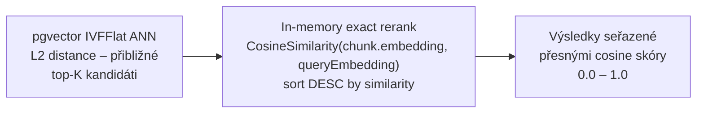

### 5.4 Generation pipeline – detail

#### System prompt (invariantní)

```
Jsi AI asistent pomáhající s analýzou nemovitostí v České republice.
Odpovídáš v češtině. Vycházíš výhradně z poskytnutého kontextu (analýz inzerátů).
Pokud kontext neobsahuje dostatečné informace, řekni to otevřeně.
Buď konkrétní, věcný a stručný.
Při odkazování na zdroje uveď jejich pořadí [1], [2], atd.
```

#### User message – struktura

```markdown
## Inzerát
{Title} | {LocationText} | {Price} Kč | {PropertyType} {OfferType}

## Uložené analýzy (kontext)

### Analýza [1]  (score: 0.87)
{chunk_1_content}

### Analýza [2]  (score: 0.74)
{chunk_2_content}

...

## Dotaz
{question}
```

#### `AskResponseDto` – výstup endpointu

```csharp
record AskResponseDto(
    string           Answer,         // odpověď LLM v češtině
    List<AnalysisChunkDto> Chunks,   // top-K chunks (ContentExcerpt max 300 znaků + score)
    bool             HasEmbeddings   // false = fallback bez vektorů byl použit
);
```

### 5.5 Plný sekvenční diagram RAG cyklu

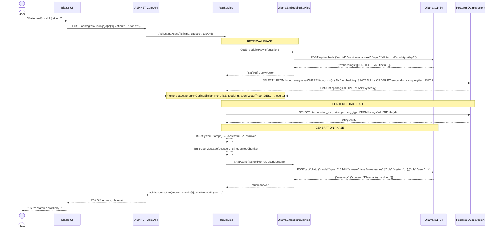

### 5.6 Vektorové indexy a SQL

#### IVFFlat – `listing_analyses.embedding`

```sql
-- Vhodný pro dynamicky rostoucí sadu (tisíce analýz)
-- Rychlý build, mírně nižší přesnost → vynáhrázeno in-memory rerankem
CREATE INDEX IF NOT EXISTS idx_listing_analyses_embedding
    ON re_realestate.listing_analyses
    USING ivfflat (embedding vector_cosine_ops)
    WITH (lists = 100);
```

> `lists = 100` – počet Voronoi buněk. Pravidlo palce: `sqrt(počet_řádků)`.
> Při hledání se prohledá `nprobes` buněk (default 1 – navýšit pro vyšší recall).

#### HNSW – `listings.description_embedding` (legacy OpenAI embeddingy)

```sql
-- Přesnější pro velké statické datasety
-- Vyšší paměťové nároky, pomalejší build, ale nejlepší ANN recall
CREATE INDEX idx_listings_description_embedding_hnsw
    ON re_realestate.listings
    USING hnsw (description_embedding vector_l2_ops)
    WITH (m = 16, ef_construction = 64);
```

#### Hybridní dotaz: SQL filtry + vektorové řazení

```sql
-- Doporučené pořadí: nejdříve redukuj B-tree/GIN/GIST, pak řaď vektorem
SELECT id, title, location_text, price, area_land,
       description_embedding <-> :query_embedding AS l2_distance
FROM   re_realestate.listings
WHERE  is_active   = true
  AND  region      = 'Jihomoravský kraj'          -- B-tree partial index
  AND  price BETWEEN 2000000 AND 5000000           -- B-tree
  AND  description_embedding IS NOT NULL
ORDER  BY description_embedding <-> :query_embedding
LIMIT  20;
```

### 5.7 Cosine similarity – matematika

Pgvector operátor `<->` vrací **L2 (euklidovskou) vzdálenost**. Pro finální skóre je potřeba přesná cosine similarity, která lépe odpovídá sémantické blízkosti:

```
CosineSimilarity(a, b) = (a · b) / (||a|| * ||b||)
                       = sum(a_i * b_i) / (sqrt(sum(a_i^2)) * sqrt(sum(b_i^2)))
```

Výsledek je v intervalu `[-1, 1]`, kde `1.0` = identický sémantický prostor.

```csharp
// RagService.cs – přesný výpočet pro reranking
private static double CosineSimilarity(Vector vectorA, float[] b)
{
    var a   = vectorA.Memory.ToArray();       // float[768] z pgvector column
    double dot = 0, magA = 0, magB = 0;

    for (int i = 0; i < a.Length && i < b.Length; i++)
    {
        dot  += a[i] * (double)b[i];
        magA += a[i] * a[i];
        magB += b[i] * (double)b[i];
    }

    return (magA == 0 || magB == 0)
        ? 0.0
        : dot / (Math.Sqrt(magA) * Math.Sqrt(magB));
}
```

### 5.8 Fallback strategie

Pokud `IEmbeddingService.IsConfigured == false` (špatné ENV) nebo žádný chunk nemá embedding, RAG **nekrachne** – místo toho načte všechny analýzy jako flat kontext:

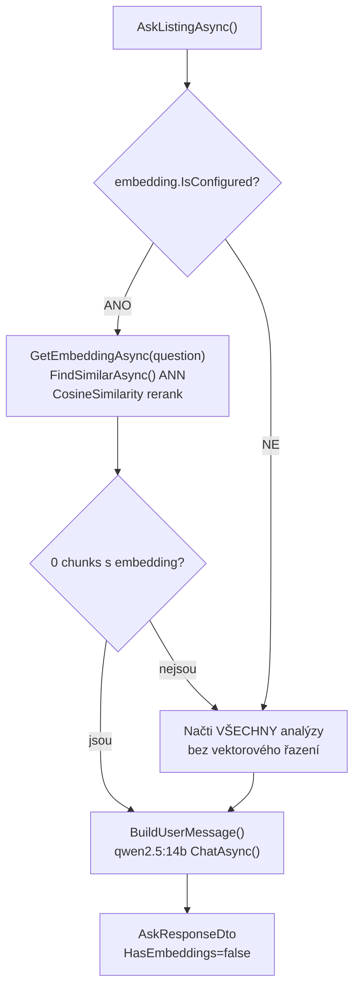

---

## 6. Ollama Vision – klasifikace fotek

### 6.1 Dvouprůchodová klasifikace

Každá fotka inzerátu projde **dvěma oddělenými voláními** Ollama Vision (`llama3.2-vision:11b`). Dvouprůchodový design je záměrný: `format: "json"` v prvním průchodu zaručuje strojově čitelný výstup, ale omezuje délku odpovědi – proto je popis (druhý průchod) bez `format: json`.

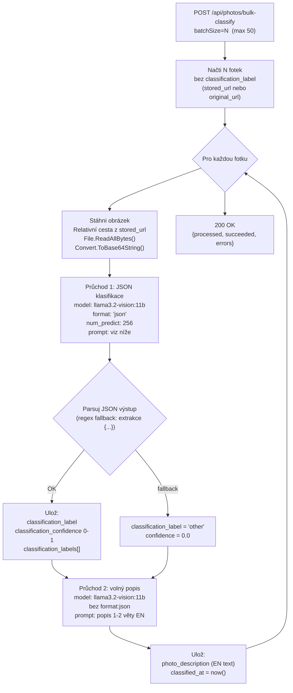

#### Prompt 1 – strukturovaná klasifikace

```json
{
  "model": "llama3.2-vision:11b",
  "prompt": "Analyze this real estate property photo.\nRespond ONLY with valid JSON:\n{\"category\":\"...\",\"labels\":[...],\"damage_detected\":false,\"confidence\":0.9}\n\ncategory: exterior|interior|kitchen|bathroom|living_room|bedroom|attic|basement|garage|land|floor_plan|damage|other\nlabels: 0-5 tags from: mold, water_damage, crack, broken_windows, damaged_roof, renovation_needed, garden, pool, fireplace, wooden_beams, new_construction, renovated, brick_walls, wooden_construction, panel_building\ndamage_detected: true if ANY visible damage\nconfidence: 0.0 to 1.0",
  "images": ["<base64>"],
  "format": "json",
  "stream": false,
  "num_predict": 256
}
```

#### Prompt 2 – volný popis

```json
{
  "model": "llama3.2-vision:11b",
  "prompt": "Describe what you see in this real estate property photo in 1-2 sentences. Focus on materials, condition, size impression, and any notable features or defects. Be specific and concise.",
  "images": ["<base64>"],
  "stream": false
}
```

#### Prioritní řazení fotek (`sort-by-category`)

| Priorita | Kategorie | Důvod |
|---|---|---|
| 1 | `exterior` | První dojem z nemovitosti |
| 2 | `interior` / `living_room` | Hlavní obytný prostor |
| 3 | `kitchen` | Kuchyně – klíčová místnost |
| 4 | `bedroom` | Ložnice – počet, velikost |
| 5 | `bathroom` | Stav koupelny |
| 6 | `garden` | Zahrada |
| 7 | `basement` / `attic` | Sklep / půda |
| 8 | `garage` | Garáž |
| 9 | `floor_plan` | Půdorys |
| 10 | `damage` | Poškození (záměrně na konec) |
| 11 | `other` | Ostatní |
| 12 | neklasifikované | Bez AI klasifikace |

### 6.2 Klasifikace fotek z prohlídky

`POST /api/photos/bulk-classify-inspection?listingId={id}&batchSize=N`

Stejný dvouprůchodový mechanismus, ale pracuje s tabulkou `user_listing_photos` – vlastní fotky pořízené při fyzické prohlídce nemovitosti.

### 6.3 Alt text (WCAG 2.2 AA)

`POST /api/photos/bulk-alt-text` generuje přístupné české popisky:

```
Prompt: "Generate a concise, descriptive alt text in Czech (max 150 chars)
         for this real estate property photo.
         Start with what is shown (e.g. 'Pohled na fasádu...'). Be specific."

Výsledek → listing_photos.alt_text
Příklad:  "Pohled na fasádu rodinného domu s dvojgaráží a malou předzahrádkou"
```

Dekorativní ikony v UI dostávají `aria-hidden="true"`, fotky bez alt textu zobrazují fallback z category labelu.

---

## 7. Ollama Text – AI funkce

Všechny čtyři textové funkce sdílí `IEmbeddingService.ChatAsync()` (→ `qwen2.5:14b` nebo `llama3.2`) – žádný vlastní HTTP klient.

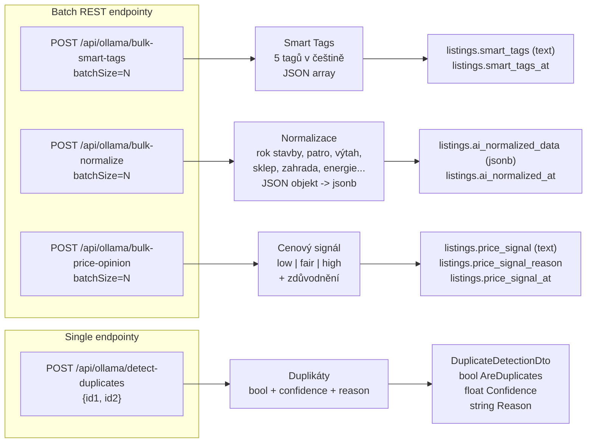

### 7.1 Smart Tags

```
System:
  "You are a Czech real estate data extractor.
   Extract exactly 5 short keyword tags from the listing description.
   Tags must be in Czech, lowercase, max 2 words each.
   Focus on: property features, amenities, construction type, condition, extras.
   Respond ONLY with valid JSON array: [\"tag1\",\"tag2\",\"tag3\",\"tag4\",\"tag5\"]"

User:
  "Název: {title}\nPopis: {description[:2000]}"

Response → ["novostavba","garáž","zahrada","podkroví","sklep"]
```

### 7.2 Normalizace dat

Extrakce strukturovaných polí z nestrukturovaného popisu inzerátu:

```
System: "You are a Czech real estate data extractor.
         From the listing description, extract structured data as JSON.
         Respond ONLY with valid JSON (no explanation):
         {
           \"year_built\": 1985,
           \"floor\": 2,
           \"total_floors\": 4,
           \"has_elevator\": false,
           \"has_basement\": true,
           \"has_garage\": false,
           \"has_garden\": true,
           \"heating_type\": \"gas\",
           \"energy_class\": \"C\",
           \"is_single_floor\": false,
           \"has_storage\": true,
           \"extension_possible\": false
         }
         Use null for missing values."
```

Výsledek uložen do `ai_normalized_data jsonb`. Využíván v **badge systému** pro vizuální hodnocení inzerátu.

### 7.3 Cenový signál

```
System: "Czech real estate pricing expert.
         Tržní ceny CZK/m²:
         Praha: byt 80k-150k, dům 60k-120k
         Brno: byt 50k-90k, dům 40k-80k
         Regionální: 20k-45k / Venkov: 5k-25k
         Return ONLY JSON: {\"signal\":\"low|fair|high\",\"reason\":\"...\"}"

Response → {"signal":"low","reason":"Cena 1.2M za dům 120m² v Třebíči = 10 000 Kč/m², pod průměrem 15-25k/m²"}
```

### 7.4 Detekce duplikátů

```
User: "Inzerát A:\nTitul: {titleA} | Cena: {priceA} | Lokalita: {locationA} | Plocha: {areaA} m²
       Popis: {descA[:500]}

       Inzerát B:\nTitul: {titleB} | ...

       Jsou tyto inzeráty duplicitní? (stejná nemovitost u více makléřů?)
       JSON: {\"are_duplicates\":true,\"confidence\":0.92,\"reason\":\"...\"}"
```

### 7.5 Robustní JSON parsování

LLM občas přidá preambuli nebo postambuli mimo JSON. `OllamaTextService` používá fallback chain:

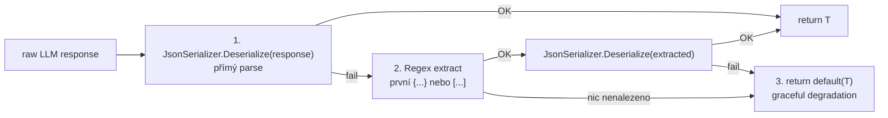

---

## 8. KN OCR – Screenshot z katastru

Uživatel může vložit screenshot z portálu [nahlíženídokn.cuzk.cz](https://nahlizenidokn.cuzk.cz) buď **Ctrl+V** (clipboard paste) nebo **drag&drop** / výběr souboru. Ollama Vision extrahuje strukturovaná katastrální data.

### Tok celé featury end-to-end

```mermaid
sequenceDiagram
    actor User
    participant JS  as kn-ocr.js (browser)
    participant BLZ as ListingDetail.razor [JSInvokable]
    participant API as CadastreEndpoints.cs
    participant CS  as CadastreService.OcrScreenshotAsync()
    participant OL  as Ollama llama3.2-vision:11b
    participant DB  as listing_cadastre_data

    User->>JS: Ctrl+V screenshot z KN portálu
    JS->>JS: document.on('paste')\nclipboardData -> first image/* item\n_fileToBase64() -> strip data URL prefix
    JS->>BLZ: invokeMethodAsync("ReceivePastedImageAsync", base64, mimeType)
    BLZ->>BLZ: _ocrPreviewSrc = "data:image/png;base64,..." -> render preview
    BLZ->>API: multipart/form-data\n{ file: bytes }
    API->>API: Validace: ContentType starts with "image/"\nmax 20 MB
    API->>CS: OcrScreenshotAsync(listingId, imageBytes)

    CS->>OL: POST /api/generate\n{ model: "llama3.2-vision:11b",\n  prompt: KN extraction prompt,\n  images: [base64],\n  format: "json",\n  num_predict: 1024,\n  stream: false }

    OL-->>CS: {"response":"{ \"parcel_number\":\"60\", \"lv_number\":\"1088\",\n  \"land_area_m2\":1250, \"land_type\":\"zahrada\",\n  \"municipality\":\"Štítary\",\n  \"encumbrances\":[{\"type\":\"věcné břemeno\",\"desc\":\"...\"}] }"}

    CS->>CS: Deserialize KnOcrData (SnakeCaseLower)
    CS->>DB: UPSERT listing_cadastre_data\n(parcel_number, lv_number, land_area_m2,\n land_type, municipality, fetch_status='ocr')
    DB-->>CS: OK
    CS-->>API: CadastreOcrResultDto(cadastre, rawJson)
    API-->>BLZ: 200 OK  OcrResultWrapper
    BLZ->>BLZ: _ocrParsed = result.Cadastre\nSnackbar "OCR dokončeno"
    BLZ-->>User: Tabulka: parcelní č., LV, výměra, druh, vlastník + seznam věcných břemen
```

#### KN Extraction Prompt

```
Extract structured data from this Czech cadastre (katastr nemovitostí) screenshot.
Return ONLY valid JSON:
{
  "parcel_number": "60",
  "lv_number": "1088",
  "land_area_m2": 1250,
  "land_type": "zahrada",
  "municipality": "Štítary",
  "cadastral_area": "Štítary",
  "owner_info": "Jan Novák",
  "protection": null,
  "encumbrances": [
    {"type": "věcné břemeno", "description": "právo chůze a jízdy", "beneficiary": "sousední parcela"}
  ],
  "building_number": null,
  "building_type": null
}
Use null for any field not visible in the screenshot.
Focus on: Parcelní číslo, Číslo LV, Výměra, Druh pozemku, Vlastníci, Věcná břemena, Zástavní práva.
```

### JS interop – `kn-ocr.js`

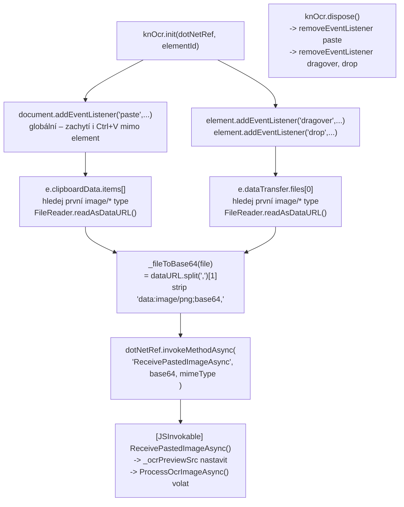

---

## 9. Prostorové vyhledávání (PostGIS)

### 9.1 Koridorové filtrování

Umožňuje najít inzeráty **podél trasy** (např. Štítary → Pohořelice, buffer 5 km).

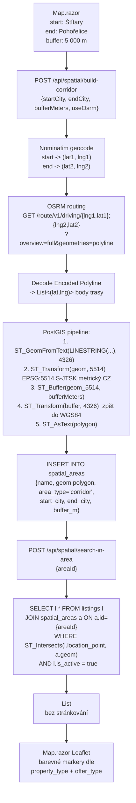

> **Proč EPSG:5514?** PostGIS `ST_Buffer` pracuje v jednotkách projekce. WGS84 je ve stupních → buffer v metrech by byl nepřesný. EPSG:5514 (S-JTSK Křovák) je metrická projekce optimalizovaná pro ČR – přesnost ~1 cm / 100 km.

### 9.2 Geocoding pipeline

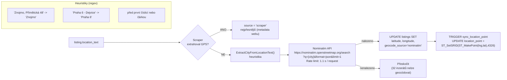

**Stav:** 1 366 / 1 416 (97 %) — 1 346 Nominatim, 20 scraper GPS.

---

## 10. DB schéma (ERD)

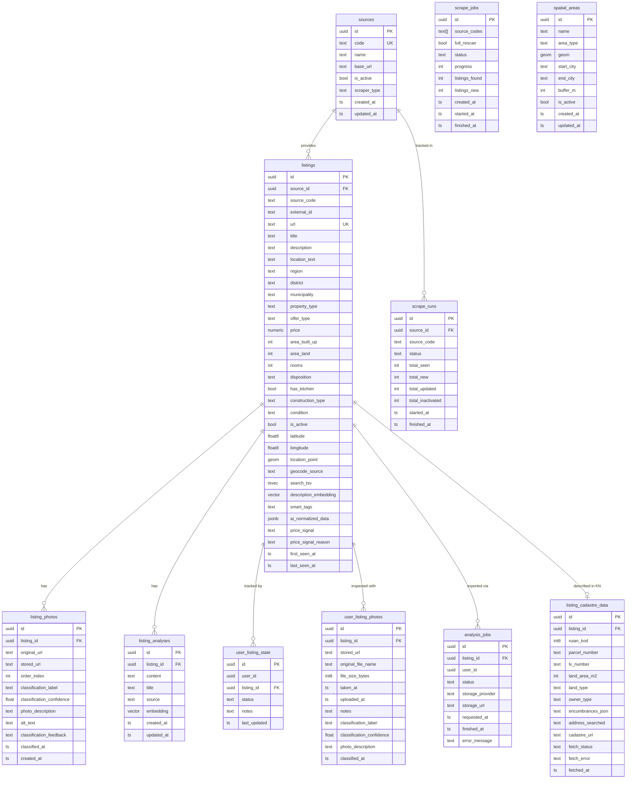

### Indexová strategie

| Index | Tabulka | Typ | Účel |
|---|---|---|---|
| `idx_listings_active_region_price` | listings | B-tree (partial) | Základní filtrování |
| `idx_listings_search_tsv` | listings | GIN | Plnotextové vyhledávání |
| `idx_listings_description_embedding_hnsw` | listings | HNSW (m=16, ef_c=64) | Sémantické vyhledávání |
| `idx_listings_location_point` | listings | GIST (partial) | Prostorové dotazy |
| `idx_listing_analyses_embedding` | listing_analyses | IVFFlat (lists=100) | RAG retrieval |
| `idx_listing_photos_listing_id` | listing_photos | B-tree | JOIN fotky |
| `idx_spatial_areas_geom` | spatial_areas | GIST | ST_Intersects |

---

## 11. API endpoint reference

> Všechny endpointy na `http://localhost:5001`. Scraping endpointy vyžadují `X-Api-Key` header.

### Listings

| Metoda | Cesta | Popis |
|---|---|---|
| `POST` | `/api/listings/search` | Stránkované filtrování (JSON `ListingFilterDto`) |
| `GET` | `/api/listings/{id}` | Detail + fotky + AI pole + katastr |
| `GET` | `/api/listings/export.csv` | CSV export (UTF-8 BOM, `;`, max 5 000) |
| `GET` | `/api/listings/my-listings` | Skupiny dle user stavu |
| `GET` | `/api/listings/{id}/export-content` | Export balíček (MD + JSON + foto URL) |
| `GET` | `/api/listings/{id}/inspection-photos` | Fotky z prohlídky |

### Photos

| Metoda | Cesta | Popis |
|---|---|---|
| `POST` | `/api/photos/bulk-classify` | Vision klasifikace inzerátních fotek |
| `POST` | `/api/photos/bulk-classify-inspection` | Vision klasifikace fotek z prohlídky |
| `POST` | `/api/photos/sort-by-category` | Přeřadit `order_index` dle priority |
| `POST` | `/api/photos/bulk-alt-text` | Generovat WCAG 2.2 AA alt texty |
| `PATCH` | `/api/photos/{id}/classification-feedback` | Feedback `correct`/`wrong` |
| `POST` | `/api/photos/bulk-download` | Stáhnout fotky do lokálního storage |
| `GET` | `/api/photos/stats` | Statistiky stažených fotek |

### Ollama Text

| Metoda | Cesta | Popis |
|---|---|---|
| `POST` | `/api/ollama/bulk-smart-tags` | 5 tagů pro N inzerátů |
| `POST` | `/api/ollama/bulk-normalize` | AI normalizace (rok, patro, výtah…) |
| `POST` | `/api/ollama/bulk-price-opinion` | Cenový signál low/fair/high |
| `POST` | `/api/ollama/detect-duplicates` | Detekce duplikátů `{id1, id2}` |
| `GET` | `/api/ollama/stats` | Počty zpracovaných AI polí |

### RAG

| Metoda | Cesta | Popis |
|---|---|---|
| `POST` | `/api/rag/ask-listing/{id}` | Chat nad konkrétním inzerátem |
| `POST` | `/api/rag/ask` | Cross-listing sémantický dotaz |
| `POST` | `/api/rag/embed/{id}` | Embedovat popis inzerátu (source=auto) |
| `POST` | `/api/rag/bulk-embed` | Bulk indexace `?limit=N` |
| `GET` | `/api/rag/analyses/{id}` | Všechny analýzy inzerátu |
| `DELETE` | `/api/rag/analyses/{analysisId}` | Smazat analýzu |

### Katastr

| Metoda | Cesta | Popis |
|---|---|---|
| `POST` | `/api/cadastre/single` | RÚIAN lookup pro jeden inzerát |
| `POST` | `/api/cadastre/bulk` | Bulk RÚIAN lookup |
| `GET` | `/api/cadastre/stats` | Statistiky KN dat |
| `POST` | `/api/cadastre/listings/{id}/ocr-screenshot` | **OCR screenshotu z KN** (multipart, max 20 MB) |

### Spatial

| Metoda | Cesta | Popis |
|---|---|---|
| `POST` | `/api/spatial/build-corridor` | Vytvořit koridor (OSRM + ST_Buffer) |
| `POST` | `/api/spatial/search-in-area` | Inzeráty v uložené oblasti |
| `GET` | `/api/spatial/areas` | Všechny uložené oblasti |
| `POST` | `/api/spatial/bulk-geocode` | Bulk geocoding (Nominatim) |
| `GET` | `/api/spatial/map-points` | GPS body pro Leaflet mapu |

### Scraping (X-Api-Key required)

| Metoda | Cesta | Popis |
|---|---|---|
| `POST` | `/api/scraping/trigger` | Spustit scraping job |
| `GET` | `/api/scraping/jobs` | Seznam jobů |
| `GET` | `/api/scraping/jobs/{id}` | Detail jobu (progress %) |
| `GET` | `/api/sources` | Seznam zdrojů |

### Export / AI analýza

| Metoda | Cesta | Popis |
|---|---|---|
| `POST` | `/api/export/google-drive/{id}` | Export do Google Drive |
| `POST` | `/api/export/onedrive/{id}` | Export do OneDrive |

---

## 12. MCP Tools – Claude Desktop integrace

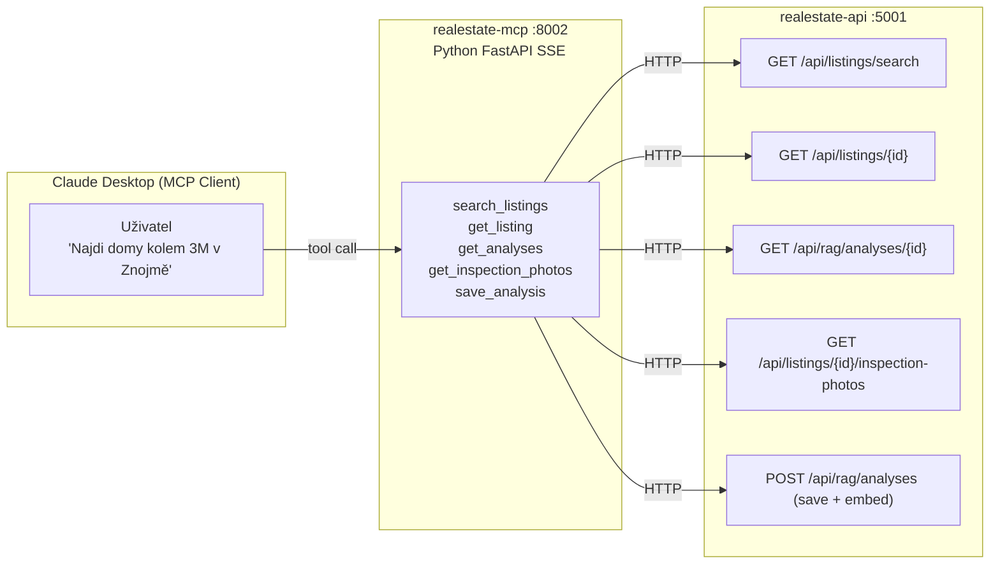

### MCP Tools reference

| Tool | R/W | Popis |
|---|---|---|
| `search_listings` | R | Vyhledávání dle query, filtrů |
| `get_listing` | R | Kompletní detail + **ZÁPIS Z PROHLÍDKY** + Drive URL |
| `get_analyses` | R | Všechny analýzy inzerátu (plný text, bez zkrácení) |
| `get_inspection_photos` | R | Fotky z prohlídky (user_listing_photos) |
| `save_analysis` | W | Uložit analýzu → DB + auto pgvector embedding |

**Klíčové vlastnosti:**
- `source="claude"` je automaticky přiřazeno při `save_analysis`
- Každá uložená analýza dostane pgvector embedding → prohledávatelná přes RAG
- `get_listing` vrací `DriveFolderUrl` a `DriveInspectionFolderUrl` pro přímý přístup k exportům

---

## 13. Export pipeline (Google Drive / OneDrive)

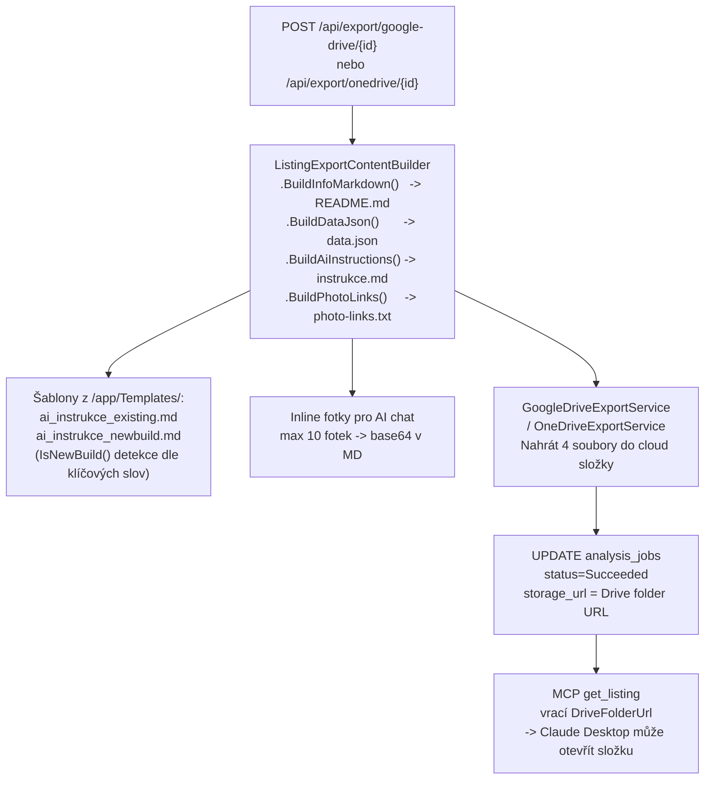

---

## 14. Konfigurace a secrets

### Klíčové env proměnné (API kontejner)

| Proměnná | Default | Popis |
|---|---|---|
| `DB_HOST` | `localhost` | Postgres host (Docker: `realestate-db`) |
| `DB_PORT` | `5432` | Postgres port |
| `OLLAMA_BASE_URL` | – | `http://host.docker.internal:11434` |
| `Ollama__EmbeddingModel` | `nomic-embed-text` | Embedding model |
| `Ollama__ChatModel` | `qwen2.5:14b` | Chat model |
| `Ollama__VisionModel` | `llama3.2-vision:11b` | Vision model |
| `Embedding__Provider` | `ollama` | `ollama` nebo `openai` |
| `Embedding__VectorDimensions` | `768` | Dimenze vektoru |
| `API_KEY` | `dev-key-change-me` | Klíč pro scraping endpointy |
| `SCRAPER_API_BASE_URL` | `http://localhost:8001` | Python scraper URL |
| `PHOTOS_PUBLIC_BASE_URL` | `http://localhost:5001` | Veřejná URL pro fotky |

### Secrets (./secrets/)

| Soubor | Obsah |
|---|---|
| `google-drive-sa.json` | Google Drive service account credentials |
| `google-drive-token.json` | OAuth2 access token (zapisuje callback handler) |
| `onedrive-token.json` | Microsoft OneDrive OAuth token |

---

## 15. Monitoring a logging

### Serilog structured logging

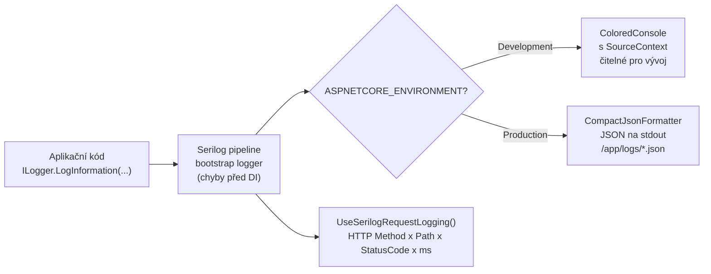

**MinimumLevel overrides:**

| Namespace | Level |
|---|---|
| Default | `Information` |
| `Microsoft.EntityFrameworkCore` | `Warning` |
| `Microsoft.AspNetCore` | `Warning` |
| `System.Net.Http` | `Warning` |

Bootstrap logger zachytí pády **před inicializací DI** – `Log.Fatal()` + `Log.CloseAndFlush()` v `try/catch` wrapperu v `Program.cs`.

### Scrape Run monitoring (SQL)

```sql
SELECT source_code,
       total_seen, total_new, total_updated, total_inactivated,
       EXTRACT(EPOCH FROM (finished_at - started_at)) AS duration_sec,
       started_at
FROM   re_realestate.v_scrape_run_stats
ORDER  BY started_at DESC
LIMIT  20;
```

---

## 16. Výkonnostní tipy & indexová strategie

### pgvector tuning

```sql
-- IVFFlat: vyšší recall za cenu pomalejšího dotazu
SET ivfflat.probes = 10;   -- default 1 (prohledá 10 buněk místo 1)

-- HNSW: přesnější index, pomalejší build
CREATE INDEX ... USING hnsw (...) WITH (m = 32, ef_construction = 128);
-- m = počet spojení v grafu (výchozí 16)
-- ef_construction = velikost search listu při buildu (výchozí 64)

-- Reindex po hromadném insertu
REINDEX INDEX CONCURRENTLY idx_listings_description_embedding_hnsw;
```

### Doporučené pořadí filtrů

SQL filtrování se řídí cenou operace. Levné filtry redukují dataset pro dražší:

```
1. WHERE is_active = true AND region = '...' AND price BETWEEN ... AND ...
   → B-tree partial index (idx_listings_active_region_price)
   → redukce na ~200-500 řádků

2. AND search_tsv @@ plainto_tsquery('czech', :query)
   → GIN index (idx_listings_search_tsv)
   → redukce na ~10-50 řádků

3. AND ST_Intersects(location_point, :corridor_geom)
   → GIST index (idx_listings_location_point)
   → redukce na inzeráty v koridoru

4. ORDER BY description_embedding <-> :queryVec LIMIT 20
   → HNSW/IVFFlat ANN – vždy jako POSLEDNÍ na nejmenší podmnožině
```

### Docker rebuild (po každé změně C# kódu!)

```bash
docker compose build --no-cache app api && docker compose up -d --no-deps app api
```

> **Zapomenutý rebuild = starý kód v kontejnerech.** Vždy rebuild po změně C# kódu.

### Embedding batch size

| Model | Throughput (CPU) | Doporučený batch |
|---|---|---|
| `nomic-embed-text` | ~0.1 s / embedding | 50–100 / request |
| `llama3.2-vision:11b` | ~7 min / 50 fotek | 20–50 / request |
| `qwen2.5:14b` (chat) | ~4 min / 50 inzerátů | 50 / request |
| `llama3.2` (text) | ~2 min / 50 inzerátů | 50 / request |

---

*Dokumentace odpovídá stavu po Session 19 – commit `9f17699` (27. 2. 2026).*
