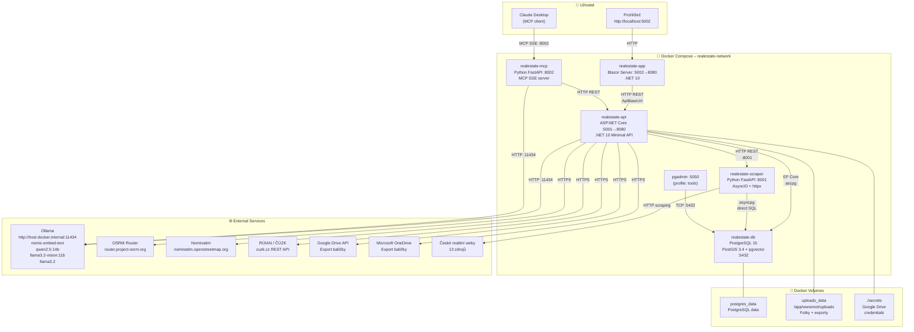
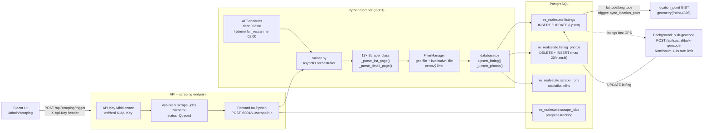
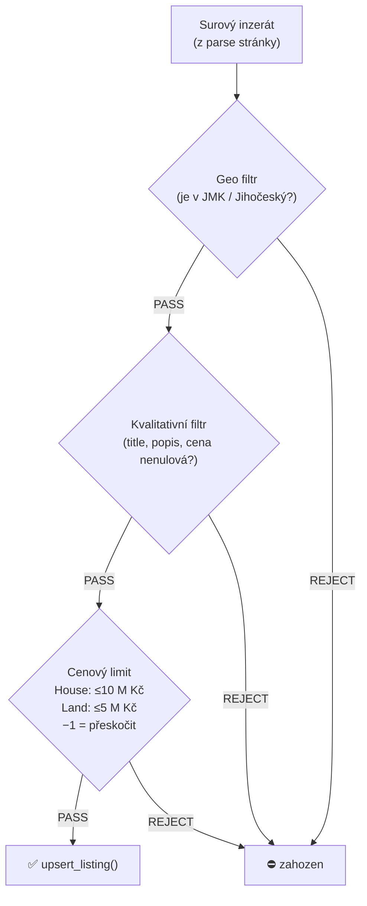
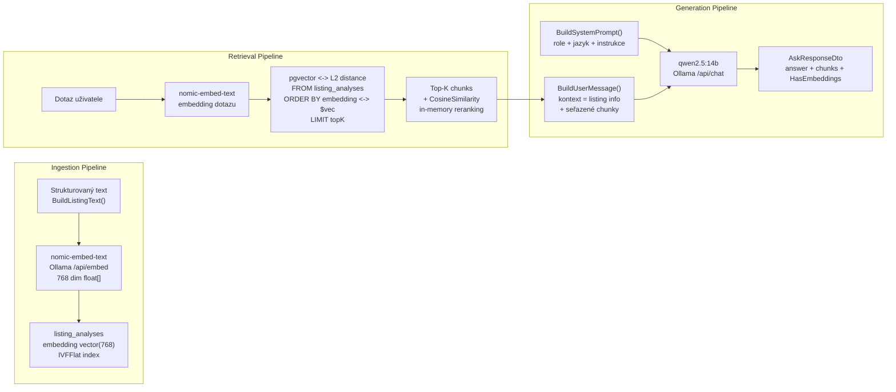
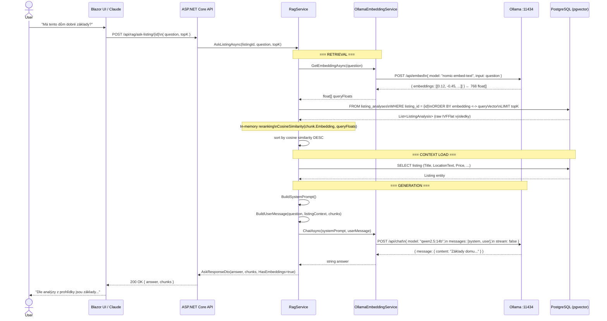
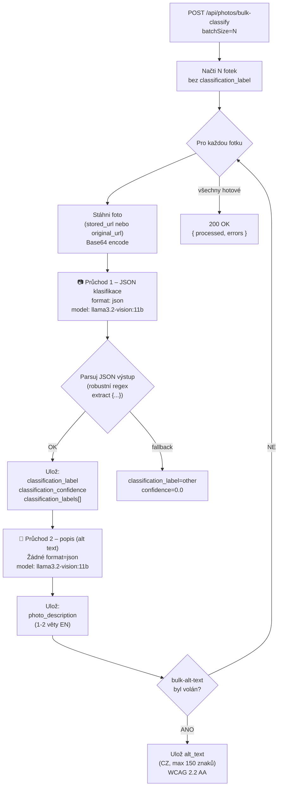
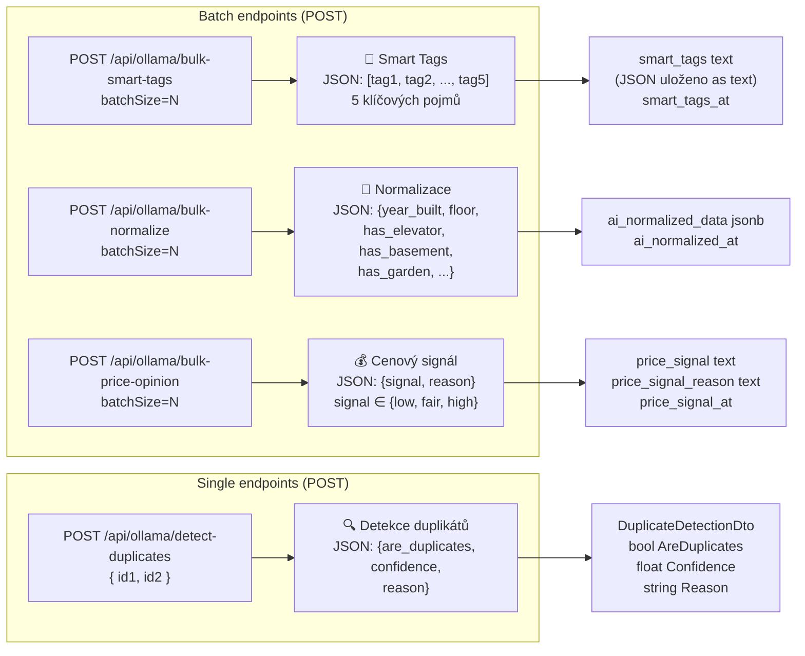
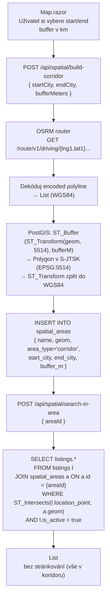
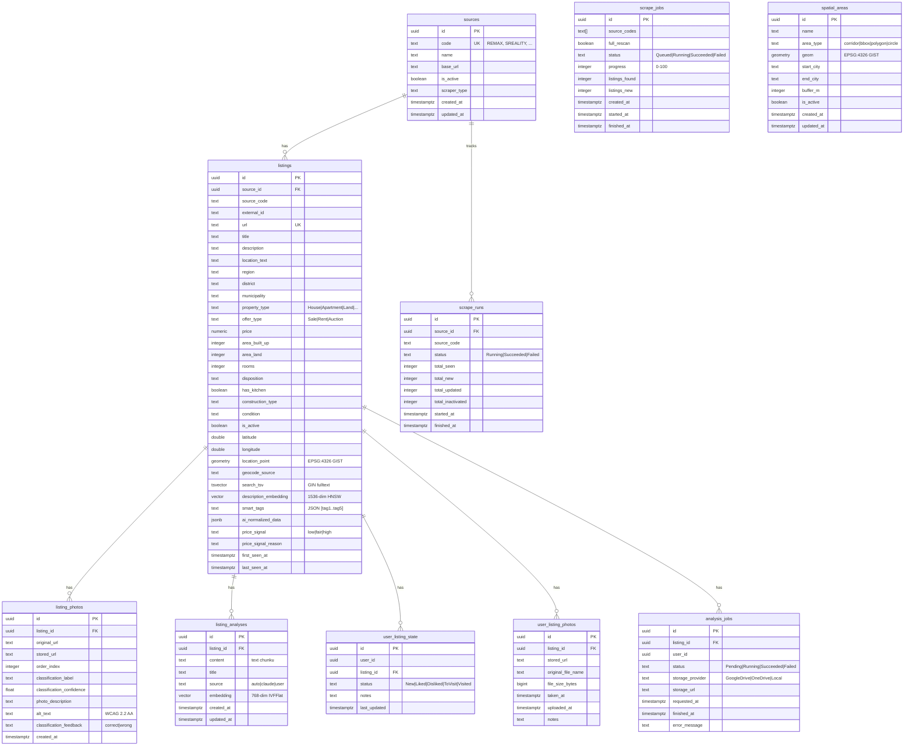
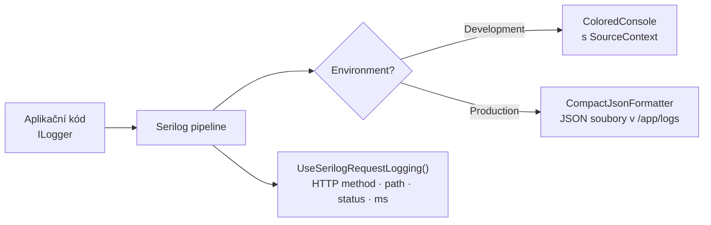

# RealEstateAggregator – Architektura systému

> **Verze:** Session 17 (únor 2026)  
> **Účel:** Zevrubný technický popis celého systému – stack, datový tok, RAG pipeline, AI funkce, DB schéma, prostorové filtry, API.

---

## Obsah

1. [Executive Summary](#1-executive-summary)
2. [Technology Stack](#2-technology-stack)
3. [Systémová architektura (Docker Compose)](#3-systémová-architektura-docker-compose)
4. [Scraping pipeline](#4-scraping-pipeline)
5. [RAG – Retrieval-Augmented Generation](#5-rag--retrieval-augmented-generation)
   - 5.1 [Ingestion pipeline](#51-ingestion-pipeline)
   - 5.2 [Retrieval pipeline](#52-retrieval-pipeline)
   - 5.3 [Generation pipeline](#53-generation-pipeline)
   - 5.4 [Sequence diagram – plný RAG cyklus](#54-sequence-diagram--plný-rag-cyklus)
   - 5.5 [SQL – vektorová podobnost](#55-sql--vektorová-podobnost)
   - 5.6 [Cosine similarity v paměti](#56-cosine-similarity-v-paměti)
6. [Ollama Vision – klasifikace fotek](#6-ollama-vision--klasifikace-fotek)
7. [Ollama Text – AI funkce](#7-ollama-text--ai-funkce)
8. [Prostorové vyhledávání (PostGIS)](#8-prostorové-vyhledávání-postgis)
9. [DB schéma (ERD)](#9-db-schéma-erd)
10. [API endpoint reference](#10-api-endpoint-reference)
11. [Konfigurace a secrets](#11-konfigurace-a-secrets)
12. [Monitoring a logging](#12-monitoring-a-logging)
13. [Výkonnostní tipy](#13-výkonnostní-tipy)

---

## 1. Executive Summary

**RealEstateAggregator** je plnohodnotná česká realitní agregační platforma, která kontinuálně stahuje inzeráty z **13 zdrojů** (SReality, iDnes, RE/MAX, CENTURY 21, M&M Reality, Prodejme.to, Premiera Reality, Delux Reality, HV Reality, Lexamo, Znojmo Reality, Nemovitosti Znojmo, Reas.cz), ukládá je do PostgreSQL s PostGIS a pgvector, a nabízí:

| Schopnost | Technologie |
|-----------|-------------|
| Agregace inzerátů z 13 zdrojů | Python AsyncIO + httpx/BeautifulSoup |
| Plnotextové vyhledávání | PostgreSQL `tsvector` + GIN index |
| Sémantické vyhledávání | pgvector HNSW (768-dim) + Ollama `nomic-embed-text` |
| RAG chat nad inzeráty | pgvector IVFFlat + Ollama `qwen2.5:14b` |
| Analýza fotek (AI Vision) | Ollama `llama3.2-vision:11b` |
| Smart tagy, cenový signál, normalizace | Ollama `llama3.2` (text) |
| Prostorové filtrování | PostGIS 3.4 (`ST_Buffer`, `ST_Intersects`) + OSRM routing |
| Katastr nemovitostí | RÚIAN / ČÚZK REST API |
| MCP integrace pro Claude Desktop | Python FastAPI MCP server |
| Export pro AI analýzu | Google Drive / OneDrive export |

**Aktuální stav:** ~1 403 aktivních inzerátů, 97 % geocódováno (Nominatim + scraper GPS).

---

## 2. Technology Stack

### Backend

| Technologie | Verze | Role |
|-------------|-------|------|
| .NET / ASP.NET Core | 10.0 | API (Minimal API endpoints) + Blazor Server App |
| Entity Framework Core | 10.x | ORM, DB migrations, LINQ queries |
| Npgsql.EntityFrameworkCore.PostgreSQL | 10.x | PostgreSQL provider + pgvector support |
| Pgvector.EntityFrameworkCore | latest | EF Core věktor typ `Vector` |
| NetTopologySuite | 2.x | Geometrické typy pro PostGIS v C# |
| Serilog.AspNetCore | 9.x | Strukturované logování (console/JSON) |

### Frontend

| Technologie | Verze | Role |
|-------------|-------|------|
| Blazor Server | .NET 10 | Interaktivní UI, real-time updates přes SignalR |
| MudBlazor | 9.x | UI komponenty (karty, filtry, dialog, mapa panel) |
| Leaflet.js | 1.x | Interaktivní mapa s markery a koridory |

### Databáze

| Technologie | Verze | Role |
|-------------|-------|------|
| PostgreSQL | 15+ | Relační databáze, schema `re_realestate` |
| PostGIS | 3.4 | Prostorová rozšíření (`geometry`, `GIST` index) |
| pgvector | 0.7+ | Vektorové embeddingy, `HNSW` a `IVFFlat` indexy |
| `uuid-ossp` | built-in | `gen_random_uuid()` pro UUIDs |

### AI / LLM

| Model | Typ | Dimenze | Účel |
|-------|-----|---------|------|
| `nomic-embed-text` | Embedding | 768 | Embeddingy pro RAG analýzy (`listing_analyses.embedding`) |
| `qwen2.5:14b` | Chat LLM | – | Generování odpovědí v RAG chatu |
| `llama3.2-vision:11b` | Vision LLM | – | Klasifikace fotek, alt text, popis fotek |
| `llama3.2` (text) | Chat LLM | – | Smart tagy, cenový signál, normalizace, detekce duplikátů |

> **Poznámka:** Historicky byl použit OpenAI `text-embedding-3-small` (1536 dim) pro `listings.description_embedding`. Nový RAG stack běží lokálně na Ollama (nomic-embed-text, 768 dim) v `listing_analyses.embedding`.

### Infrastructure

| Technologie | Účel |
|-------------|------|
| Docker Compose | Orchestrace 5 služeb + pgAdmin (tools profile) |
| Colima / ARM64 | macOS Docker runtime (native ARM64, bez Rosetta) |
| OSRM | Open-source routing engine pro výpočet koridorů |
| Nominatim (OSM) | Geocoding adres (open-source) |
| RÚIAN / ČÚZK | Katastrální data a ověření parcel |
| APScheduler (Python) | Denní / týdenní plánování scrapingu |
| Google Drive / OneDrive | Cloud storage pro AI export balíčky |

---

## 3. Systémová architektura (Docker Compose)



### Síťová komunikace (uvnitř Dockeru)

| Caller | Callee | Adresa |
|--------|--------|--------|
| `app` | `api` | `http://realestate-api:8080` |
| `api` | `scraper` | `http://realestate-scraper:8001` |
| `api` / `mcp` | Ollama | `http://host.docker.internal:11434` |
| `api` / `scraper` | postgres | `postgres:5432` |

---

## 4. Scraping pipeline

### Přehled toku dat



### Upsert logika (Python)

Deduplikace inzerátů probíhá podle kompozitního klíče `(source_id, external_id)`:

```python
# database.py – pseudokód
existing = await conn.fetchrow(
    "SELECT id FROM re_realestate.listings "
    "WHERE source_id = $1 AND external_id = $2",
    source_id, external_id
)

if existing:
    await conn.execute("UPDATE re_realestate.listings SET ... WHERE id = $1", existing["id"])
else:
    listing_id = uuid4()
    await conn.execute("INSERT INTO re_realestate.listings (...) VALUES (...)")
```

### Deaktivace zaniklých inzerátů

Při `full_rescan=true` runner po dokončení volá `deactivate_unseen_listings()` – všechny inzeráty zdroje, které nebyly vidět v aktuálním běhu, dostanou `is_active=false`.

### Filtrovací pipeline (Python `FilterManager`)



---

## 5. RAG – Retrieval-Augmented Generation

RAG systém umožňuje přirozenojazyčný chat nad uloženými analýzami inzerátů. Skládá se ze tří logicky oddělených pipeline: **ingestion** (vkladání textů do vektoru), **retrieval** (hledání relevantního kontextu) a **generation** (generování odpovědi LLM).



### 5.1 Ingestion pipeline

#### Kde vznikají analýzy

Analýzy (chunks) se ukládají do `listing_analyses` třemi způsoby:

| Způsob | Source tag | Obsah |
|--------|-----------|-------|
| Automatická indexace popisu | `"auto"` | Strukturovaný text z `BuildListingText()` |
| Manuální uložení z Claude Desktop (MCP) | `"claude"` | Libovolný text – výsledek analýzy AI |
| Uložení z UI pohledu | `"user"` | Uživatelovy poznámky |

#### `BuildListingText()` – šablona strukturovaného textu

```
# {Title}
Typ: {PropertyType} | Nabídka: {OfferType}
Cena: {Price} Kč
Lokalita: {LocationText}
Obec: {Municipality} | Okres: {District}
Dispozice: {Disposition} | Plocha zastavěná: {AreaBuiltUp} m² | Plocha pozemku: {AreaLand} m²
Stav: {Condition} | Konstrukce: {ConstructionType}

## Popis
{Description}
```

Text je před embeddingem zkrácen na **8 000 znaků** (limit `OllamaEmbeddingService`).

#### Idempotence `EmbedListingDescriptionAsync()`

```csharp
// Zabrání duplicitní indexaci
bool alreadyEmbedded = await db.ListingAnalyses
    .AnyAsync(a => a.ListingId == listingId && a.Source == "auto", ct);
if (alreadyEmbedded) return;
```

#### Bulk indexace `BulkEmbedDescriptionsAsync(limit)`

Vyhledá aktivní inzeráty bez `source="auto"` analýzy, seřadí od nejnovějšího (`FirstSeenAt` DESC) a indexuje v dávce size `limit`.

### 5.2 Retrieval pipeline

#### `FindSimilarAsync(query, topK, ct, listingId?)`

```sql
-- Listing-specifické vyhledávání (listingId IS NOT NULL)
SELECT * FROM re_realestate.listing_analyses
WHERE listing_id = {listingId}
  AND embedding IS NOT NULL
ORDER BY embedding <-> {queryVector}   -- L2 distance (pgvector operátor)
LIMIT {topK};

-- Cross-listing vyhledávání (listingId IS NULL)
SELECT * FROM re_realestate.listing_analyses
WHERE embedding IS NOT NULL
ORDER BY embedding <-> {queryVector}
LIMIT {topK};
```

> **Implementační detail:** pgvector provádí aproximativní vyhledávání přes IVFFlat index (`vector_cosine_ops`). Výsledky jsou pak seřazeny přesnou **cosine similarity** v paměti (viz 5.6).

#### Fallback při chybějících embeddingách

Pokud `embedding.IsConfigured == false` nebo žádný chunk nemá embedding, `AskListingAsync` načte **všechny** analýzy inzerátu bez vektorového řazení a předá je jako flat kontext.

### 5.3 Generation pipeline

#### System prompt (konstantní)

```
Jsi AI asistent pomáhající s analýzou nemovitostí v České republice.
Odpovídáš v češtině. Vycházíš výhradně z poskytnutého kontextu (analýz inzerátů).
Pokud kontext neobsahuje dostatečné informace, řekni to otevřeně.
Buď konkrétní, věcný a stručný. Při odkazování na zdroje uveď jejich pořadí [1], [2], atd.
```

#### User message struktura

```markdown
## Inzerát
{Title} | {LocationText} | {Price} Kč | {PropertyType} {OfferType}

## Uložené analýzy (kontext)

### Analýza [1]
{chunk_1_content}

### Analýza [2]
{chunk_2_content}

...

## Dotaz
{question}
```

#### `AskResponseDto` – výstup

```csharp
record AskResponseDto(
    string Answer,
    List<AnalysisChunkDto> Chunks,  // top-K chunky s ContentExcerpt (max 300 znaků) + similarity score
    bool HasEmbeddings
);
```

### 5.4 Sequence diagram – plný RAG cyklus



### 5.5 SQL – vektorová podobnost

#### IVFFlat index na `listing_analyses`

```sql
CREATE INDEX IF NOT EXISTS idx_listing_analyses_embedding
    ON re_realestate.listing_analyses
    USING ivfflat (embedding vector_cosine_ops)
    WITH (lists = 100);
```

> **IVFFlat vs HNSW:** `listing_analyses` používá IVFFlat (rychlejší build, vhodný pro ~tisíce záznamů). `listings.description_embedding` používá HNSW (přesnější, vhodný pro statické velké datasety).

#### HNSW index na `listings.description_embedding`

```sql
CREATE INDEX idx_listings_description_embedding_hnsw
    ON re_realestate.listings
    USING hnsw (description_embedding vector_l2_ops)
    WITH (m = 16, ef_construction = 64);
```

#### Hybridní dotaz: filtry + sémantické vyhledávání

```sql
SELECT id, title, location_text, price, area_land,
       description_embedding <-> :query_embedding AS distance
FROM re_realestate.listings
WHERE is_active = true
  AND region = 'Jihomoravský kraj'
  AND price BETWEEN 2000000 AND 5000000
  AND description_embedding IS NOT NULL
ORDER BY description_embedding <-> :query_embedding
LIMIT 20;
```

### 5.6 Cosine similarity v paměti

Pgvector `<->` operátor vrací **L2 (euklidovskou) vzdálenost**. Pro výsledné skóre podobnosti se přepočítává přesná cosine similarity v C#:

```csharp
private static double CosineSimilarity(Vector vectorA, float[] b)
{
    var a = vectorA.Memory.ToArray();
    double dot = 0, magA = 0, magB = 0;
    for (int i = 0; i < a.Length && i < b.Length; i++)
    {
        dot  += a[i] * b[i];
        magA += a[i] * a[i];
        magB += b[i] * b[i];
    }
    return magA == 0 || magB == 0
        ? 0.0
        : dot / (Math.Sqrt(magA) * Math.Sqrt(magB));
}
```

Výsledek je v intervalu `[-1, 1]`, kde `1.0 = identický vektor`.

---

## 6. Ollama Vision – klasifikace fotek

### Přehled

Pro každou fotku inzerátu se volají **dva průchody** Ollama Vision modelu (`llama3.2-vision:11b`) přes endpoint `POST /api/generate` (Ollama legacy generate API).



### Prompt 1 – JSON klasifikace

```json
{
  "model": "llama3.2-vision:11b",
  "prompt": "Classify this real estate photo. Return ONLY valid JSON:\n{\"category\":\"...\",\"labels\":[...],\"damage_detected\":false,\"confidence\":0.95}\nCategories: exterior, interior_living, interior_kitchen, interior_bathroom, interior_bedroom, garden, basement, garage, floor_plan, other",
  "images": ["<base64>"],
  "format": "json",
  "stream": false
}
```

### Prompt 2 – Volný popis

```json
{
  "model": "llama3.2-vision:11b",
  "prompt": "Describe this real estate photo in 1-2 sentences in English. Focus on what is visible.",
  "images": ["<base64>"],
  "stream": false
}
```

### Kategorie a prioritní řazení fotek

`POST /api/photos/sort-by-category` přeřadí `order_index` fotek podle priority:

| Priorita | Kategorie |
|----------|-----------|
| 1 | `exterior` |
| 2 | `interior_living` |
| 3 | `interior_kitchen` |
| 4 | `interior_bedroom` |
| 5 | `interior_bathroom` |
| 6 | `garden` |
| 7 | `basement` |
| 8 | `garage` |
| 9 | `floor_plan` |
| 10 | `other` |
| 11 | Neklasifikované |

### Alt text – WCAG 2.2 AA

`POST /api/photos/bulk-alt-text` generuje přístupné české popisky fotek:

```text
Prompt: "Generate a concise, descriptive alt text in Czech (max 150 chars) for this real estate photo. Start with what is shown."
→ "Pohled na fasádu rodinného domu s dvojgaráží a zahradou"
```

Výsledek uložen do `listing_photos.alt_text`. Dekorativní ikony dostávají `aria-hidden="true"`, fotky bez alt textu zobrazují fallback z kategorie.

---

## 7. Ollama Text – AI funkce

`OllamaTextService` využívá sdílenou metodu `IEmbeddingService.ChatAsync(systemPrompt, userMessage)` – žádný vlastní HTTP klient, vše jde přes `qwen2.5:14b` (nebo `llama3.2`).



### Smart Tags – prompt

```
System: "Jsi expert na českou realitní terminologii."
User: "Na základě popisu nemovitosti vygeneruj přesně 5 klíčových tagů v češtině.
Vrať POUZE JSON array: [\"tag1\",\"tag2\",\"tag3\",\"tag4\",\"tag5\"]

Popis:
{description}"
```

### Normalizace – prompt

```
System: "Jsi expert na extrakci dat z realitních popisů."
User: "Z popisu extrahuj strukturovaná data. Vrať POUZE JSON:
{
  \"year_built\": 1985,
  \"floor\": 2,
  \"total_floors\": 4,
  \"has_elevator\": false,
  \"has_basement\": true,
  \"has_garage\": false,
  \"has_garden\": true,
  \"heating_type\": \"gas\",
  \"energy_class\": \"C\"
}
Pokud info chybí, použij null. Popis: {description}"
```

### Cenový signál – prompt

Systém zná tržní ceny:

```
Praha: 80 000–150 000 Kč/m² (byt), 60 000–120 000 Kč/m² (dům)
Brno: 50 000–90 000 Kč/m² (byt), 40 000–80 000 Kč/m² (dům)
Regionální města: 20 000–45 000 Kč/m²
Venkov / vesnice: 5 000–25 000 Kč/m²
```

Výstup:
```json
{ "signal": "low", "reason": "Cena 1.2M za dům 120m² v Třebíči odpovídá 10 000 Kč/m², což je pod regionálním průměrem 15-25 000 Kč/m²." }
```

### Detekce duplikátů – vstup

Porovnávají se dva inzeráty s celým kontextem:

```
Inzerát A:
Titul: {titleA} | Cena: {priceA} Kč | Lokalita: {locationA} | Plocha: {areaA} m²
Popis: {descriptionA[:500]}

Inzerát B:
...

Jsou tyto inzeráty duplicitní nebo různé nabídky stejné nemovitosti?
JSON: { "are_duplicates": true, "confidence": 0.92, "reason": "..." }
```

### Robustní JSON parsování

LLM nevrací vždy čistý JSON. `OllamaTextService` používá fallback chain:

```csharp
1. JsonSerializer.Deserialize<T>(response)           // přímý parse
2. Regex: extract první {...} nebo [...]              // strip preamble/postamble
3. return default(T)                                 // graceful degradation
```

---

## 8. Prostorové vyhledávání (PostGIS)

### Koridorové filtrování

Umožňuje najít inzeráty podél trasy (například `Štítary → Pohořelice` s bufferem 5 km).



### Geocoding pipeline

```
1. Scraper GPS (source='scraper')      → nejpřesnější, z metadat webu
2. Nominatim geocoding (source='nominatim') → OSM databáze, 1.1s rate limit
3. Heuristika: ExtractCityFromLocationText()
   → "Znojmo, Přímětická 48" → "Znojmo"
   → "Praha 6 – Dejvice" → "Praha 6"
```

**Stav:** 1 366 / 1 403 inzerátů geocódováno (97 % pokrytí).

### Klíčové PostGIS funkce

| Funkce | Účel |
|--------|------|
| `ST_SetSRID(ST_MakePoint(lng, lat), 4326)` | Vytvoření bodu z lat/lng (trigger) |
| `ST_Transform(geom, 5514)` | Převod z WGS84 do S-JTSK (metrické CZ) |
| `ST_Buffer(geom, meters)` | Vytvoření koridoru/kruhu |
| `ST_Intersects(a, b)` | Test průniku (využívá GIST index) |
| `ST_DWithin(a, b, meters)` | Hledání v poloměru |

---

## 9. DB schéma (ERD)



### Indexová strategie

| Index | Tabulka | Typ | Účel |
|-------|---------|-----|------|
| `idx_listings_active_region_price` | listings | B-tree (partial) | Základní filtrování |
| `idx_listings_search_tsv` | listings | GIN | Plnotextové vyhledávání |
| `idx_listings_description_embedding_hnsw` | listings | HNSW (m=16, ef_c=64) | Sémantické vyhledávání |
| `idx_listings_location_point` | listings | GIST (partial) | Prostorové dotazy |
| `idx_listing_analyses_embedding` | listing_analyses | IVFFlat (lists=100) | RAG retrieval |
| `idx_listing_photos_listing_id` | listing_photos | B-tree | JOIN fotky |
| `idx_spatial_areas_geom` | spatial_areas | GIST | ST_Intersects koridory |

---

## 10. API endpoint reference

Všechny endpointy jsou na `http://localhost:5001`. Scraping endpointy vyžadují `X-Api-Key` header.

### Listings

| Metoda | Cesta | Popis |
|--------|-------|-------|
| `POST` | `/api/listings/search` | Stránkované filtrování (JSON body `ListingFilterDto`) |
| `GET` | `/api/listings/{id}` | Detail inzerátu + fotky + AI pole |
| `GET` | `/api/listings/export.csv` | Export CSV (UTF-8 BOM, semicolony, max 5 000) |
| `GET` | `/api/listings/my-listings` | Skupiny dle user stavu (ToVisit / Liked / Visited / Disliked) |

### Photos

| Metoda | Cesta | Popis |
|--------|-------|-------|
| `POST` | `/api/photos/bulk-classify` | Vision klasifikace fotek |
| `POST` | `/api/photos/sort-by-category` | Přeřadit `order_index` dle kategorie |
| `POST` | `/api/photos/bulk-alt-text` | Generovat WCAG alt text |
| `PATCH` | `/api/photos/{id}/classification-feedback` | Feedback `correct`/`wrong` |
| `POST` | `/api/photos/bulk-download` | Stáhnout fotky do lokálního storage |
| `GET` | `/api/photos/stats` | Statistiky stažených fotek |
| `GET` | `/api/listings/{id}/inspection-photos` | Fotky z prohlídky (user_listing_photos) |

### Ollama Text

| Metoda | Cesta | Popis |
|--------|-------|-------|
| `POST` | `/api/ollama/bulk-smart-tags` | Smart tagy pro N inzerátů |
| `POST` | `/api/ollama/bulk-normalize` | AI normalizace dat |
| `POST` | `/api/ollama/bulk-price-opinion` | Cenový signál |
| `POST` | `/api/ollama/detect-duplicates` | Detekce duplikátů (id1, id2) |
| `GET` | `/api/ollama/stats` | Počty zpracovaných AI polí |

### RAG

| Metoda | Cesta | Popis |
|--------|-------|-------|
| `POST` | `/api/rag/ask-listing/{id}` | Chat nad konkrétním inzerátem |
| `POST` | `/api/rag/ask` | Cross-listing sémantický chat |
| `POST` | `/api/rag/embed/{id}` | Indexovat popis inzerátu |
| `POST` | `/api/rag/bulk-embed` | Bulk indexace (limit param) |
| `GET` | `/api/rag/analyses/{id}` | Všechny analýzy inzerátu |
| `DELETE` | `/api/rag/analyses/{analysisId}` | Smazat analýzu |

### Spatial

| Metoda | Cesta | Popis |
|--------|-------|-------|
| `POST` | `/api/spatial/build-corridor` | Vytvořit koridor (OSRM + ST_Buffer) |
| `POST` | `/api/spatial/search-in-area` | Inzeráty v oblasti |
| `GET` | `/api/spatial/areas` | Všechny uložené oblasti |
| `POST` | `/api/spatial/bulk-geocode` | Bulk geocoding (Nominatim) |
| `GET` | `/api/spatial/map-points` | GPS body pro Leaflet mapu |

### Katastr

| Metoda | Cesta | Popis |
|--------|-------|-------|
| `POST` | `/api/cadastre/single` | RÚIAN lookup pro jeden inzerát |
| `POST` | `/api/cadastre/bulk` | Bulk RÚIAN lookup |
| `GET` | `/api/cadastre/stats` | Statistiky katastrálních dat |

### Scraping (vyžaduje `X-Api-Key`)

| Metoda | Cesta | Popis |
|--------|-------|-------|
| `POST` | `/api/scraping/trigger` | Spustit scraping job |
| `GET` | `/api/scraping/jobs` | Seznam jobů |
| `GET` | `/api/scraping/jobs/{id}` | Detail jobu (progress %) |
| `GET` | `/api/sources` | Seznam zdrojů |

### Export / AI analýza

| Metoda | Cesta | Popis |
|--------|-------|-------|
| `POST` | `/api/export/google-drive/{id}` | Export do Google Drive |
| `POST` | `/api/export/onedrive/{id}` | Export do OneDrive |
| `GET` | `/api/listings/{id}/export-content` | Export balíček (MD + JSON + foto URL) |

### MCP Server (:8002)

| Tool | Read/Write | Popis |
|------|-----------|-------|
| `search_listings` | Read | Hledání inzerátů |
| `get_listing` | Read | Detail + zápis z prohlídky + Drive URL |
| `get_analyses` | Read | Všechny analýzy (plný obsah) |
| `get_inspection_photos` | Read | Fotky z prohlídky |
| `save_analysis` | Write | Uložit analýzu + embedding |

---

## 11. Konfigurace a secrets

### Klíčové env proměnné (API)

| Proměnná | Default | Popis |
|----------|---------|-------|
| `DB_HOST` | `localhost` | Postgres host (docker: `postgres`) |
| `DB_PORT` | `5432` | Postgres port |
| `OLLAMA_BASE_URL` | – | Ollama endpoint (`http://host.docker.internal:11434`) |
| `Ollama__VisionModel` | `llama3.2-vision:11b` | Vision model |
| `Embedding__Provider` | `ollama` | `ollama` nebo `openai` |
| `Embedding__VectorDimensions` | `768` | Dimenze vektoru |
| `API_KEY` | `dev-key-change-me` | Klíč pro scraping endpointy |
| `SCRAPER_API_BASE_URL` | `http://localhost:8001` | Python scraper URL |
| `PHOTOS_PUBLIC_BASE_URL` | `http://localhost:5001` | Veřejná URL pro fotky |

### Secrets (./secrets/)

| Soubor | Obsah |
|--------|-------|
| `google-drive-sa.json` | Google Drive service account credentials |
| `google-drive-token.json` | OAuth2 access token (zapisuje callback) |
| `onedrive-token.json` | Microsoft OneDrive OAuth token |

---

## 12. Monitoring a logging

### Serilog (ASP.NET Core API)



**Bootstrap logger:** zachytí chyby před inicializací DI (startup pád).

**MinimumLevel overrides:**

| Namespace | Úroveň |
|-----------|--------|
| Default | `Information` |
| `Microsoft.EntityFrameworkCore` | `Warning` |
| `Microsoft.AspNetCore` | `Warning` |
| `System.Net.Http` | `Warning` |

### Scrape Run monitoring

Každý běh scraperu zapisuje do `scrape_runs`:

```sql
SELECT source_code, total_new, total_updated, total_inactivated,
       EXTRACT(EPOCH FROM (finished_at - started_at)) AS duration_sec
FROM re_realestate.v_scrape_run_stats
ORDER BY last_run_at DESC;
```

---

## 13. Výkonnostní tipy

### pgvector tuning

```sql
-- Vyšší přesnost (produkce – velké datasety):
CREATE INDEX ... WITH (m = 32, ef_construction = 128);

-- Rychlejší build (vývoj / malé datasety):
CREATE INDEX ... WITH (m = 8, ef_construction = 32);

-- Reindex po hromadném insertu:
REINDEX INDEX CONCURRENTLY idx_listings_description_embedding_hnsw;
```

### Doporučené pořadí filtrů

1. **Klasické WHERE** klauzule (region, price, property_type) – B-tree indexy
2. **Fulltext** `search_tsv @@ plainto_tsquery(...)` – GIN index
3. **Prostorové** `ST_Intersects(location_point, corridor_geom)` – GIST index
4. **Vektorové** `ORDER BY embedding <-> :vec LIMIT K` – HNSW/IVFFlat (vždy jako poslední, na nejmenší podmnožině)

### Embedding batch size

- Ollama `nomic-embed-text`: bez rate limitu, ale sekvenční (ne paralelní – jeden model)
- Doporučený batch: 50–100 inzerátů na request do `/api/rag/bulk-embed`

### Docker rebuild after C# changes

```bash
docker compose build --no-cache app api && docker compose up -d --no-deps app api
```

> ⚠️ **Zapomenutý rebuild = starý kód v kontejnerech.** Vždy po změně C# kódu.
